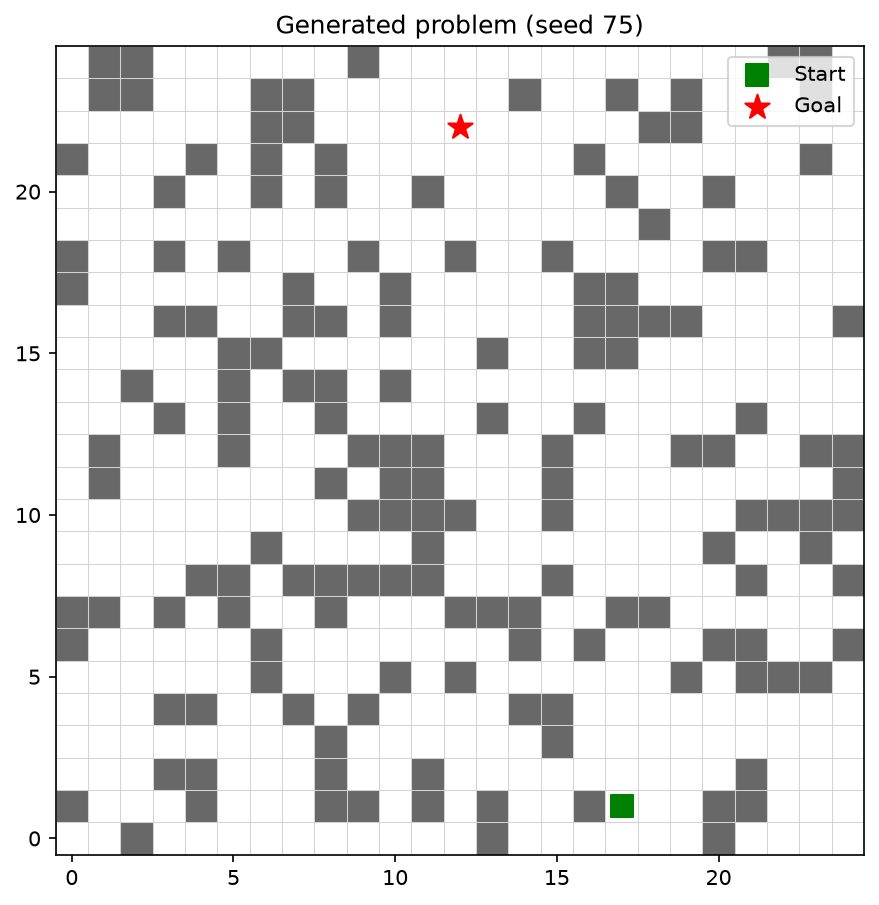
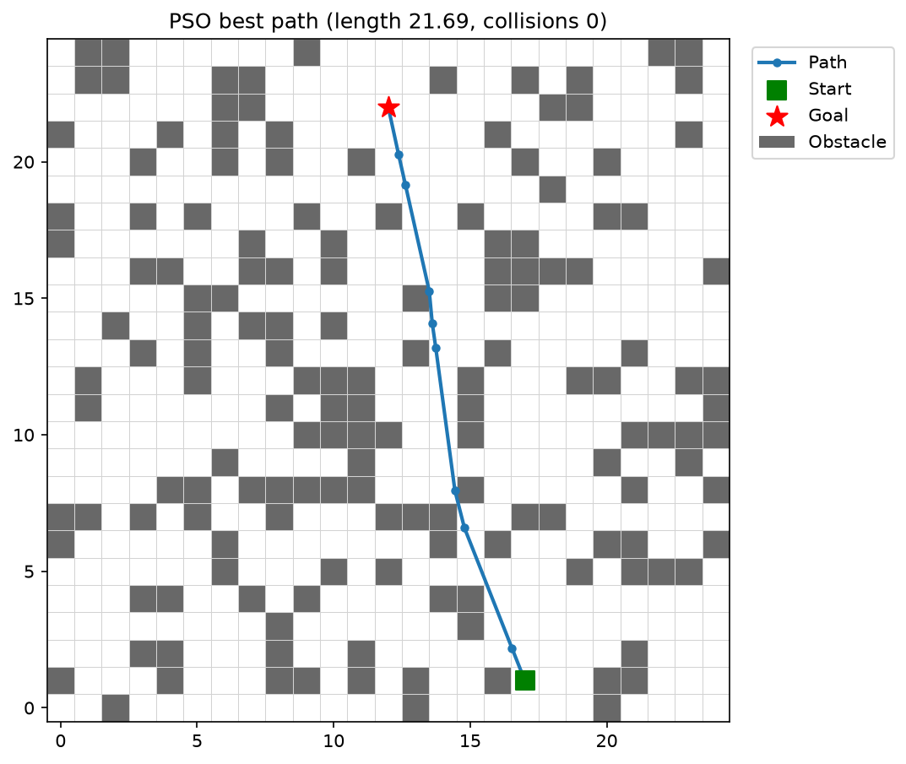
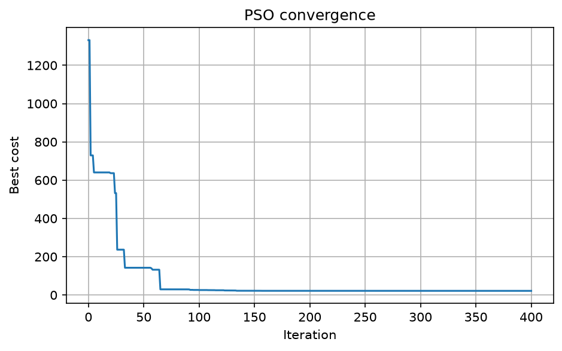
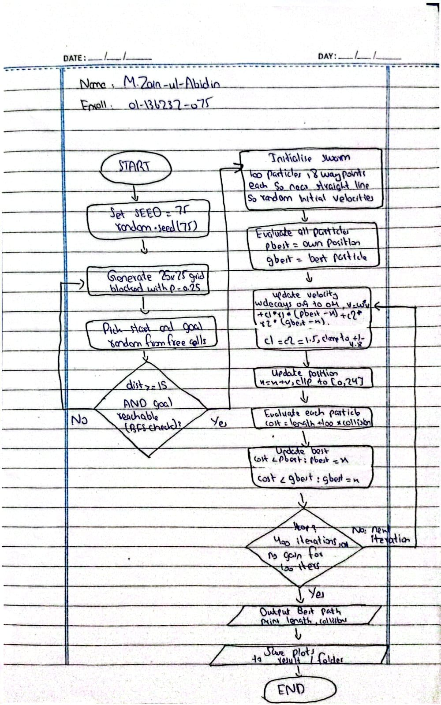

# Swarm-Based Path Planning with Obstacles (PSO)

## Student Information

- Name: Muhammad Zain ul Abidin
- Roll Number: 075
- Random Seed: **75** (`SEED = 75` in `pso_pathplanning.py`)
- Course: Swarm Intelligence Lab, Assignment 1
- University: Bahria University

## Problem Instance

Generated programmatically from the seed (nothing is hardcoded):

- Grid: 25 x 25, about 25% obstacle density (`random.seed(75)`)
- Obstacles: 157 blocked cells
- Start: (17, 1), Goal: (12, 22), both on free cells
- A BFS reachability check validates that the goal can be reached. It is used only to validate the instance, never for planning.



## Approach

Particle Swarm Optimization over continuous waypoints.

- **Particle encoding:** each particle holds 8 intermediate waypoints (x, y). The path is start -> w1 ... w8 -> goal.
- **Fitness (lower is better):** total Euclidean path length + 100 x (number of sample points along the path that fall inside an obstacle cell). Segments are sampled every 0.25 units.
- **PSO:** swarm of 100 particles, up to 400 iterations, inertia weight decaying linearly from 0.9 to 0.4, c1 = c2 = 1.5, velocity clamping, positions clipped to the grid. Half the swarm starts near the straight line, half uniformly random. Stops early if the global best does not improve for 100 iterations.
- **Reproducibility:** the PSO random generator is seeded with the same value (`np.random.default_rng(75)`), so repeated runs give the same result.

## How to Run

```bash
pip install -r requirements.txt
python pso_pathplanning.py
```

The script prints the best cost, path length, collision count and whether the path is obstacle-free. Plots are saved to the `results/` folder (no window needs to be closed).

## Results

| Metric | Value |
|---|---|
| Path length | 21.69 |
| Collisions | 0 (obstacle-free) |
| Straight-line distance start -> goal (lower bound) | 21.59 |

The best path is only about 0.5% longer than the straight-line lower bound.



The convergence curve starts at a cost of about 1330 (the best initial particle still crossed obstacles, and each collision costs 100). The cost drops sharply in the first ~65 iterations as particles find collision-free routes, then flattens near the final length of 21.69.



## Limitations

- The path is a continuous polyline, not cell-by-cell moves. A segment is collision-free when none of its sample points lie inside a blocked cell.
- Collision checking is by sampling, so a very thin corner clip between samples could in principle be missed. The found path also passes close to some obstacle edges, since there is no safety margin.
- PSO with a penalty function is not guaranteed to find a collision-free path for every seed. For seed 75 it did, and the script prints whether the final path is obstacle-free.

## Flow Diagram

